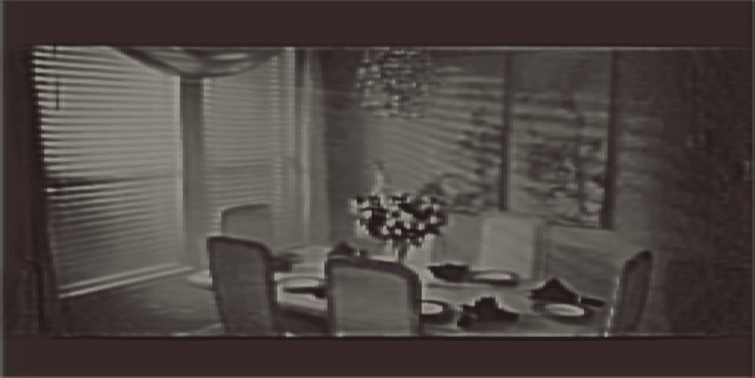
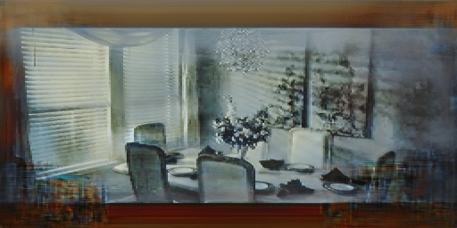

# Dehazer

🌥️ **Welcome to the Dehazing project!** 🌥️

This project focuses on utilizing machine learning techniques to remove haze and enhance visibility in images and videos. The core architecture used here is the UNet neural network, well-suited for image-to-image translation tasks.

## Basic Features

✨ **Key Features** ✨

- **Image Dehazing:** The model is designed to remove haze and improve visibility in images and video frames.
- **U-Net Architecture:** Leveraging the power of UNet, a popular choice for image restoration and enhancement tasks.
- **Requirements:** Make sure you have TensorFlow, scikit-learn, OpenCV, and other dependencies installed (see requirements.txt).

## Getting Started

🚀 **Getting Started** 🚀

1. Clone this repository to your local machine:

   ```bash
   git clone https://github.com/yourusername/dehazing-unet.git


2. Install required dependencies using the following command

   pip install -r requirements.txt

3. Make sure your Environment Variables are set correctly

## Sample Input Output

By enhancing the model architecture through the addition of supplementary layers and training it on high-performance dedicated GPUs, we can achieve outputs with significantly higher resolutions.  

### **Sample Input**


### **Sample Output U-Net**




### **Sample Output Pix2Pix**




